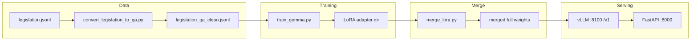

# Finetuning a Gemma 4 Model with Legal Data

This repository fine-tunes a **Gemma** family model (default: `google/gemma-4-E4B`) on **UK legislation** using **LoRA**, serves inference with **vLLM** (OpenAI-compatible), and exposes a small **FastAPI** layer with legal-focused routes. Optional **Cloudflare quick tunnels** expose the API over HTTPS without opening firewall ports.

---

## What this project does

1. **Data**: Raw statutory text lives in `legislation.jsonl`. The script `convert_legislation_to_qa.py` turns it into chat-style JSONL (simulated RAG context + questions + grounded answers), e.g. `legislation_qa_clean.jsonl`.
2. **Training**: `train_gemma.py` runs **supervised fine-tuning (SFT)** with **TRL**’s `SFTTrainer`, training **LoRA adapters** on the language model only (vision/audio towers can be frozen).
3. **Inference**: After training, you **merge** the adapter into the base weights with `merge_lora.py` so **vLLM** can load a single full-precision checkpoint.
4. **API**: `api.py` proxies to vLLM, adds a default UK-legislation system prompt, and applies light post-processing to reduce question-echo artifacts.

---

## How it works (architecture)



- **vLLM** serves the merged model at `http://0.0.0.0:8100/v1` with the logical name `legal-lora` (see `serve.sh`). It uses `chat_template.jinja` and `--chat-template-content-format string` so Gemma chat formatting is consistent with training.
- **FastAPI** (`api.py`) uses the OpenAI client pointed at `VLLM_BASE_URL` (default `http://localhost:8100/v1`) and calls the same model name (`MODEL_NAME`, default `legal-lora`).

---

## Prerequisites

- **NVIDIA GPU** with enough VRAM for Gemma 4 E4B + training or inference (an H100-class machine is assumed in `setup_and_train.sh`; adjust batch size / QLoRA if needed).
- **CUDA** visible to PyTorch (`nvidia-smi` works).
- **Hugging Face account** and **token** with access to the gated Gemma checkpoint (`HF_TOKEN` or `huggingface-cli login` / `hf auth login`).

---

## Python environment

The repo expects a virtual environment at `.venv` (used by `run.sh` and `serve.sh`). You can create it and install dependencies in either of these ways:

**Option A — full VM bootstrap (installs system packages, PyTorch cu124, training stack):**

```bash
chmod +x setup_and_train.sh
export HF_TOKEN=hf_your_token_here   # optional; otherwise interactive login
./setup_and_train.sh
```

**Option B — minimal install** (matches comments in `train_gemma.py`):

```bash
python3 -m venv .venv
source .venv/bin/activate
pip install --upgrade pip
pip install "torch>=2.3" torchvision torchaudio --index-url https://download.pytorch.org/whl/cu124
pip install "transformers[chat_template]>=5.5.0" "trl>=1.0.0" "datasets>=3.0" accelerate peft bitsandbytes
# Serving stack (if not already installed):
pip install vllm fastapi uvicorn httpx openai
```

For inference and merging you need at least: `torch`, `transformers`, `peft`, `vllm`, `fastapi`, `uvicorn`, `httpx`, `openai`.

---

## 1. Prepare training data

**Convert flat legislation JSONL to chat JSONL:**

```bash
source .venv/bin/activate
python convert_legislation_to_qa.py \
  --input legislation.jsonl \
  --output legislation_qa.jsonl
```

Use or curate a file such as `legislation_qa_clean.jsonl` (chat `messages` with `user` / `assistant` turns). The trainer accepts:

- `{"messages": [...]}` (recommended here),
- `{"text": "..."}`,
- `{"prompt": "...", "completion": "..."}`,
- Alpaca-style `instruction` / `output` (see `train_gemma.py`).

---

## 2. Fine-tune (LoRA)

**Using the bundled script** (after `./setup_and_train.sh` or an equivalent venv):

```bash
source .venv/bin/activate
export HF_TOKEN=hf_your_token_here   # if required for the base model

python train_gemma.py \
  --model_id google/gemma-4-E4B \
  --dataset_path legislation_qa_clean.jsonl \
  --output_dir ./gemma-legal-qa-clean-lora \
  --num_train_epochs 5 \
  --learning_rate 1e-4 \
  --max_seq_length 1024 \
  --gradient_accumulation_steps 4
```

Useful flags:

| Flag | Purpose |
|------|--------|
| `--load_in_4bit` | QLoRA-style training if VRAM is tight |
| `--per_device_train_batch_size` | Lower if OOM (default `1`) |
| `--use_lora` / `--lora_r` / `--lora_alpha` | LoRA configuration (default rank 16, alpha 32) |

`chat_template.jinja` must exist in the repo root when using `messages`-format data with a tokenizer that has no built-in chat template (see `train_gemma.py`).

**Output**: adapter and tokenizer files under `--output_dir` (e.g. `./gemma-legal-qa-clean-lora`).

**Before training**, stop anything else using the GPU (e.g. `pkill -f 'vllm serve'`).

---

## 3. Merge LoRA into the base model

vLLM in this setup loads **merged full weights**, not a separate PEFT adapter at serve time.

```bash
source .venv/bin/activate
python merge_lora.py \
  --base_model google/gemma-4-E4B \
  --adapter_path ./gemma-legal-qa-clean-lora \
  --output_path ./gemma-legal-qa-clean-merged
```

This writes `config.json`, weights, and tokenizer (including chat template from `chat_template.jinja` when present) into `--output_path`.

---

## 4. Serve with vLLM

```bash
source .venv/bin/activate
export MODEL_PATH=/absolute/path/to/gemma-legal-qa-clean-merged   # optional; defaults to ./gemma-legal-qa-clean-merged under repo root
export VLLM_PORT=8100                                              # optional
chmod +x serve.sh
./serve.sh
```

vLLM exposes an **OpenAI-compatible** HTTP API, e.g.:

- List models: `GET http://localhost:8100/v1/models`
- Chat: `POST http://localhost:8100/v1/chat/completions` with `"model": "legal-lora"`

Example:

```bash
curl -s http://localhost:8100/v1/chat/completions \
  -H "Content-Type: application/json" \
  -d '{
    "model": "legal-lora",
    "messages": [
      {"role": "system", "content": "You are a legal expert for UK legislation."},
      {"role": "user", "content": "What is section 1 about?"}
    ],
    "max_tokens": 256,
    "temperature": 0.3
  }'
```

---

## 5. Serve the FastAPI front end

Point the API at the running vLLM instance:

```bash
source .venv/bin/activate
export VLLM_BASE_URL=http://localhost:8100/v1
export MODEL_NAME=legal-lora
export API_PORT=8000
python api.py
```

Or with uvicorn:

```bash
uvicorn api:app --host 0.0.0.0 --port 8000
```

Interactive docs: `http://0.0.0.0:8000/docs`

### FastAPI routes

| Method | Path | Description |
|--------|------|-------------|
| `GET` | `/health` | Checks vLLM reachability via `GET {VLLM_BASE_URL}/models` |
| `POST` | `/v1/legal/analyze` | Single legal query; wraps default or custom system prompt |
| `POST` | `/v1/legal/chat` | Multi-turn chat; model fixed to `MODEL_NAME` |

**Health:**

```bash
curl -s http://127.0.0.1:8000/health
```

**Analyze (JSON):**

```bash
curl -s http://127.0.0.1:8000/v1/legal/analyze \
  -H "Content-Type: application/json" \
  -d '{
    "query": "Summarise the main obligations in the provided context.",
    "max_tokens": 512,
    "temperature": 0.3
  }'
```

**Chat:**

```bash
curl -s http://127.0.0.1:8000/v1/legal/chat \
  -H "Content-Type: application/json" \
  -d '{
    "messages": [
      {"role": "system", "content": "You assist with UK legislation."},
      {"role": "user", "content": "What does section 2 require?"}
    ],
    "max_tokens": 512,
    "temperature": 0.3
  }'
```

Both endpoints support `"stream": true` (SSE). Optional environment variables in `api.py` include `LEGAL_SYSTEM_PROMPT`, `DEFAULT_MAX_TOKENS`, `DEFAULT_TEMPERATURE`, `FREQUENCY_PENALTY`, `PRESENCE_PENALTY`, and `USER_QUERY_PREFIX`.

---

## 6. One command: vLLM + FastAPI

```bash
chmod +x run.sh
./run.sh
```

This starts vLLM (`serve.sh`), waits until `http://localhost:8100/v1/models` responds, then starts `api.py` with `VLLM_BASE_URL=http://localhost:8100/v1` and waits for `/health`.

Environment variables:

| Variable | Default | Meaning |
|----------|---------|---------|
| `VENV_DIR` | `./.venv` | Python venv |
| `VLLM_PORT` | `8100` | vLLM port |
| `API_PORT` | `8000` | FastAPI port |
| `WITH_TUNNEL` | `0` | Set to `1` to start a Cloudflare quick tunnel to FastAPI after health checks |

---

## 7. Public HTTPS with Cloudflare quick tunnel

Quick tunnels use `trycloudflare.com` URLs; no Cloudflare account is required for basic use.

**Install `cloudflared` (downloads to `~/.local/bin` if missing):**

```bash
bash scripts/cloudflare_tunnel.sh
```

**Foreground tunnel** (must have FastAPI already listening on the target port):

```bash
export TUNNEL_TARGET=http://127.0.0.1:8000
bash scripts/cloudflare_tunnel.sh --run
```

**Background tunnel** (waits for `/health` on `TUNNEL_TARGET`):

```bash
bash scripts/cloudflare_tunnel.sh --background
```

**From `run.sh`** (starts tunnel after vLLM + API are healthy):

```bash
WITH_TUNNEL=1 ./run.sh
```

The public URL is printed when available; otherwise check `/tmp/legaltech-cloudflared-tunnel.log`.

**Example** (replace `https://YOUR-SUBDOMAIN.trycloudflare.com` with the printed URL):

```bash
curl -s https://YOUR-SUBDOMAIN.trycloudflare.com/health
```

`./tunnel.sh` is a thin wrapper around `scripts/cloudflare_tunnel.sh`.

---

## Repository layout (main pieces)

| Path | Role |
|------|------|
| `legislation.jsonl` | Source legislation text |
| `convert_legislation_to_qa.py` | Build chat JSONL for SFT |
| `legislation_qa_clean.jsonl` | Example curated training file |
| `chat_template.jinja` | Gemma chat template for training + vLLM |
| `train_gemma.py` | LoRA SFT with TRL |
| `setup_and_train.sh` | VM setup + one-shot training |
| `merge_lora.py` | Merge adapter → full weights for vLLM |
| `serve.sh` | `vllm serve` with merged model |
| `api.py` | FastAPI proxy + legal routes |
| `run.sh` | vLLM + FastAPI (+ optional tunnel) |
| `scripts/cloudflare_tunnel.sh` | Cloudflare quick tunnel helper |

---

## Troubleshooting

- **Gated model / 401 on Hub**: set `HF_TOKEN` and accept the model license on Hugging Face.
- **OOM during training**: use `--load_in_4bit`, reduce `--max_seq_length` or `--per_device_train_batch_size`, or increase `--gradient_accumulation_steps`.
- **vLLM won’t start**: ensure `merge_lora.py` was run and `MODEL_PATH` (or default `./gemma-legal-qa-clean-merged`) contains `config.json`.
- **FastAPI `/health` fails**: confirm vLLM is up: `curl -s http://localhost:8100/v1/models`.
